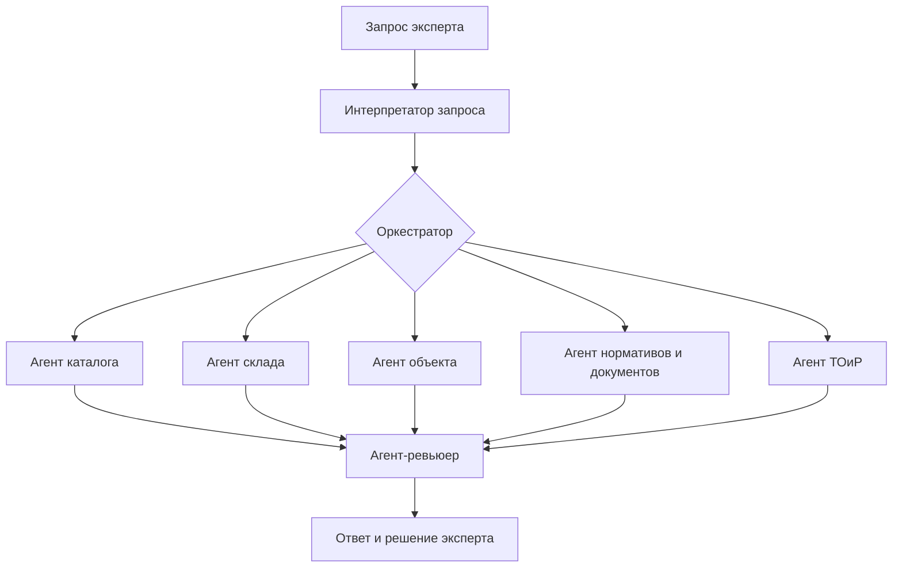

# Агентная система MVP

## Общий принцип

Агент нужен не для каждого запроса. Точный код или одна карточка
обрабатываются обычным поиском. Оркестратор запускает агентов, когда
нужно связать каталог, склад, объект, документы и несколько правил.

## Интерпретатор запроса

Вход: исходная фраза пользователя.

Действия:

- распознает алиасы и опечатки;
- определяет намерение;
- извлекает коды, размеры, среду и ограничения;
- отмечает неизвестные параметры;
- передает данные маршрутизатору.

Результат: карточка требования и прозрачный маршрут обработки.

## Оркестратор

Оркестратор не ищет данные самостоятельно. Он определяет порядок вызова
инструментов, следит за бюджетом шагов и собирает промежуточные
результаты.

Для обычного поиска оркестратор не запускается. Для агентного запроса он
завершает работу, если отсутствует обязательный источник или требуется
решение эксперта.

## Агент каталога

Ищет МТР и КСМ в PostgreSQL и Qdrant, применяет фильтры и возвращает
кандидатов. Не утверждает техническую взаимозаменяемость.

## Агент склада

Получает остатки по КСМ, считает дефицит и формирует черновик пополнения.
Не определяет пригодность изделия по одному факту наличия.

## Агент объекта

Работает со связями `объект -> участок -> компонент -> КСМ`. Находит
соседние элементы и показывает, что затронет замена. На первом этапе
может работать с JSON-графом, затем с графовой БД при доказанной пользе.

## Агент нормативов и документов

Ищет паспорт, ТУ, ГОСТ, ЛНД и конкретные фрагменты. Разделяет:

- требование среды;
- подтвержденное свойство кандидата;
- неизвестное свойство;
- конфликтующие сведения.

Этот агент не выводит пригодность к H2S или CO2 только из названия среды.

## Агент ТОиР

Формирует рекомендательный план ремонта, список основных изделий и
недостающих классов материалов. Он не создает производственный наряд и
не заменяет требования промышленной безопасности.

## Агент-ревьюер

Проверяет итог перед показом пользователю:

- есть ли источник у каждого важного вывода;
- сохранены ли обязательные предупреждения;
- не придуманы ли документы или позиции;
- отделена ли рекомендация от решения эксперта;
- перечислены ли неизвестные данные.

## Порядок реализации

1. Обычный поиск, правила и склад.
2. Оркестратор с фиксированными инструментами.
3. Агент объекта на тестовом JSON-графе.
4. Агент документов и нормативов.
5. Агент ТОиР.
6. Ревьюер и автоматическая проверка 40 вопросов.

Такой порядок позволяет не внедрять графовую БД и сложный ReAct-цикл до
того, как обычный поиск и правила стабильно работают.
