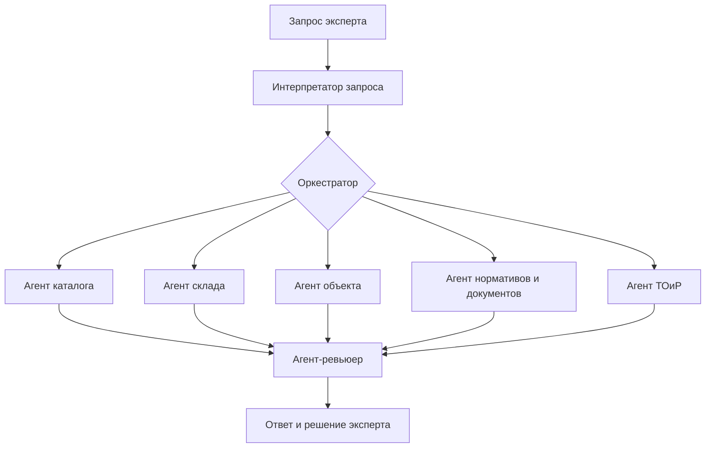

# Агентная система MVP

## Общий принцип

Агент нужен не для каждого запроса. Точный код или одна карточка
обрабатываются обычным поиском. Оркестратор запускает агентов, когда
нужно связать каталог, склад, объект, документы и несколько правил.

## Интерпретатор запроса

Вход: исходная фраза пользователя.

Действия:

- распознает алиасы и опечатки;
- определяет намерение;
- извлекает коды, размеры, среду и ограничения;
- отмечает неизвестные параметры;
- передает данные маршрутизатору.

Результат: карточка требования и прозрачный маршрут обработки.

При низкой уверенности или неоднозначностях (`confidence < 0.85` или
`ambiguities`) запускается LLM-коррекция (`EntityExtractor.extract` →
`LLMService.validate_and_correct_query`). Действует защита от деградации:
LLM не может удалить факты, уже извлечённые rule-based парсером
(коды участков/компонентов и операции), уверенность берётся максимальная.
Если LLM недоступна — возвращается исходный результат парсера.

## LLM-роли в конвейере

LLM — усилитель поверх детерминированного офлайн-конвейера. Офлайн-путь
остаётся базой и фолбэком. Режим задаётся переменной `AGENT_LLM_MODE`
(`auto` — всегда пытаться с офлайн-фолбэком, `off` — только офлайн, `on` —
обязательно). Провайдер: OpenRouter с фолбэком на локальную Ollama.

| Роль | Вход | Что делает LLM | Когда | Fallback |
|---|---|---|---|---|
| L1. Интерпретатор | `ParsedQuery` + фраза | Правит интент/операции, DN/PN, материал, среду, context; добавляет `ambiguities`, confidence | `confidence < 0.85` или есть `ambiguities` | исходный `ParsedQuery` |
| L2. Ревьюер | черновик `AgentAnswer` | Содержательные замечания по чек-листу (выдуманные документы, смешение false/null, непроверяемые утверждения) | всегда после сборки ответа | детерминированный ревьюер |
| L3. Синтез ответа | результаты тулов | Связный `answer` для эксперта; структуру `components/warnings/sources` не меняет | всегда | `"\n".join(answers)` |
| L4. Маршрутизация | фраза + детерминированное решение | Уточняет маршрут ordinary/agent/clarification и интент (`llm_router.py`, `/route`) | маршрут неоднозначен (нет кода и нехватки параметров) | детерминированное решение `route_query_text` |
| L5. Объяснение кандидатов | кандидат + запрос | «Почему кандидат в выдаче» для топ-3 (`llm_explainer.py`) | `explain`-операция и LLM доступна | правило по типу изделия |

## Оркестратор

Оркестратор не ищет данные самостоятельно. Он определяет порядок вызова
инструментов, следит за бюджетом шагов и собирает промежуточные
результаты.

Для обычного поиска оркестратор не запускается. Для агентного запроса он
завершает работу, если отсутствует обязательный источник или требуется
решение эксперта.

## Агент каталога

Ищет МТР и КСМ в PostgreSQL и Qdrant, применяет фильтры и возвращает
кандидатов. Не утверждает техническую взаимозаменяемость.

## Агент склада

Получает остатки по КСМ, считает дефицит и формирует черновик пополнения.
Не определяет пригодность изделия по одному факту наличия.

## Агент объекта

Работает со связями `объект -> участок -> компонент -> КСМ`. Находит
соседние элементы и показывает, что затронет замена. На первом этапе
может работать с JSON-графом, затем с графовой БД при доказанной пользе.

## Агент нормативов и документов

Ищет паспорт, ТУ, ГОСТ, ЛНД и конкретные фрагменты. Разделяет:

- требование среды;
- подтвержденное свойство кандидата;
- неизвестное свойство;
- конфликтующие сведения.

Этот агент не выводит пригодность к H2S или CO2 только из названия среды.

## Агент ТОиР

Формирует рекомендательный план ремонта, список основных изделий и
недостающих классов материалов. Он не создает производственный наряд и
не заменяет требования промышленной безопасности.

## Агент-ревьюер

Проверяет итог перед показом пользователю:

- есть ли источник у каждого важного вывода;
- сохранены ли обязательные предупреждения;
- не придуманы ли документы или позиции;
- не смешаны ли «не подтверждено» (null) и «подтверждено как отсутствующее» (false);
- отделена ли рекомендация от решения эксперта;
- перечислены ли неизвестные данные.

Ревьюер двухслойный:

1. Детерминированный чек-лист (`agents/reviewer.py`): источники у позиций,
   непустой ответ, `human_review_required` для интентов с решением эксперта,
   критерии вопроса (mandatory_warning, required_sources, answer_must_include).
2. LLM-ревьюер (`agents/llm_reviewer.py`) поверх детерминированного: добавляет
   содержательные замечания и выставляет вердикт `pass`/`needs_review`.

Без LLM остаётся результат детерминированного ревьюера. Вердикт и замечания
попадают в поля `review_verdict` и `review_issues` ответа агента.

## Порядок реализации

1. Обычный поиск, правила и склад.
2. Оркестратор с фиксированными инструментами.
3. Агент объекта на тестовом JSON-графе.
4. Агент документов и нормативов.
5. Агент ТОиР.
6. Ревьюер и автоматическая проверка 40 вопросов:
   - 6a. детерминированный ревьюер `agents/reviewer.py`;
   - 6b. LLM-ревьюер поверх детерминированного `agents/llm_reviewer.py`;
   - 6c. LLM-синтез ответа `agents/llm_agent.py` (mode `llm_augmented`);
   - 6d. автопроверка 40 вопросов `test_40_questions.py` + отчёт
        в `data/evaluation/results/40_questions_report.json`.
7. Маршрутизация с LLM (L4, `services/llm_router.py`) и объяснение кандидатов
   (L5, `services/llm_explainer.py`) — после того, как 40 вопросов стабильно
   проходят приёмку.

Такой порядок позволяет не внедрять графовую БД и сложный ReAct-цикл до
того, как обычный поиск и правила стабильно работают.

## Маршрутизатор (L4)

`services/llm_router.py` уточняет детерминированное решение
`search_router.route_query_text` эндпоинтом `/route`:

- LLM включается только когда детерминированный результат неоднозначен
  (нет точного кода и нет нехватки параметров);
- точный код МТР/КСМ и нехватка параметров — детерминированные факты,
  LLM их не переопределяет;
- ответ LLM валидируется: маршрут должен быть
  `ordinary|agent|clarification`, интент — из известного списка,
  уверенность — не ниже порога;
- при недоступности LLM, низкой уверенности или невалидном ответе
  возвращается детерминированное решение (поле `llm_refined=false`).

## Объяснение кандидатов (L5)

`services/llm_explainer.py` объясняет, почему кандидат попал в выдачу:
- сравнивает только фактически указанные свойства карточки, не выдумывает;
- для топ-3 кандидатов подключается в тул `explanation_generator`
  (при `AGENT_LLM_MODE != off`);
- при недоступности LLM или пустых причинах — правило-фолбэк по типу
  изделия (DN/PN/угол/материал уточняет эксперт).

LLM-маршрутизатор и объяснитель отключены по умолчанию
(`AGENT_LLM_MODE=off`) и покрываются юнит-тестами со стабом LLM.
