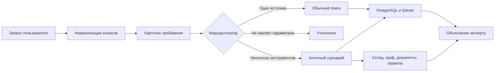

# Маршрутизация и проверка ответов

## Зачем отдельно проверять понимание запроса

Обработка запроса состоит из трех разных этапов:

1. Нормализатор и LLM понимают фразу пользователя и формируют требование
   к изделию.
2. PostgreSQL и Qdrant находят карточки-кандидаты.
3. Правила или агенты проверяют кандидатов, склад, объект и документы.

Если поиск вернул неправильный результат, без такого разделения нельзя
понять причину: LLM неверно прочитала `426 на 10` или поисковый индекс не
нашел правильную карточку.

PostgreSQL хранит карточки и остатки. Qdrant ищет похожие карточки по
смыслу. Они не разбирают пользовательскую фразу вместо LLM, а получают
уже нормализованный запрос.

Фраза «найти кандидатов» и «найти аналоги» в MVP означает одно действие:
система возвращает несколько возможных аналогов, обычно Top-20. Она не
имеет права самостоятельно объявить один вариант окончательной заменой.

Отдельно переписывать 40 вопросов в 40 дублирующих карточек сейчас не
нужно. В `data/evaluation/complex_questions_40.jsonl` уже хранятся:

- `category` - намерение пользователя;
- `target_entities` - известные изделия или объекты;
- `required_tools` - необходимые шаги обработки;
- `required_sources` - нужные источники;
- `answer_must_include` - обязательные части ответа;
- `mandatory_warning` - предупреждение, которое нельзя потерять.

Эталонные карточки разбора понадобятся только для прямых запросов к
изделиям после выбора окончательной LLM. Тогда сравниваются конкретные
поля `item_type`, `dn`, `pn`, размеры, материал и среда.

## Как выбирается маршрут

Маршрут не определяется одним словом. Проверяются точные коды, классы
изделий, склад, объект, документы, ремонт, среда и число необходимых
действий.

Фактический словарь пользовательских формулировок находится в
`data/domain/query_aliases.csv`. Он используется до вызова LLM и содержит
алиасы параметров, изделий, сред и действий. Таблица `synonyms` в
PostgreSQL решает другую задачу: сравнивает уже извлеченные значения
карточек, например варианты нормализованного наименования материала.

Обычный поиск используется для `AQ004`, `AQ021`, `AQ022` и `AQ025`.
Остальные 36 согласованных вопросов требуют агентного сценария.

Маршрут «уточнение» проверяется отдельно. Например, запрос `Нужен аналог
отвода DN159` не содержит угол и толщину стенки.

## Критерии правильного ответа

У каждого вопроса критерии находятся в том же JSONL-файле, рядом с
текстом вопроса. Так вопрос и его проверка не расходятся по разным
таблицам.

Правильный ответ должен:

- выполнить все пункты `answer_must_include`;
- использовать указанные `required_sources`;
- сохранить `mandatory_warning`;
- разделить совпадения, расхождения и неизвестные данные;
- не придумывать отсутствующие карточки или документы;
- оставить финальное решение эксперту.

Неправильным считается ответ, который уверенно подтверждает аналог без
доказательств, скрывает неизвестные параметры, смешивает `false` и
`null`, ссылается на несуществующий документ или предлагает отсутствующую
в каталоге деталь как найденную.

Эти же критерии показываются в Streamlit в блоке «Критерии правильного
ответа», когда введен один из согласованных вопросов.
